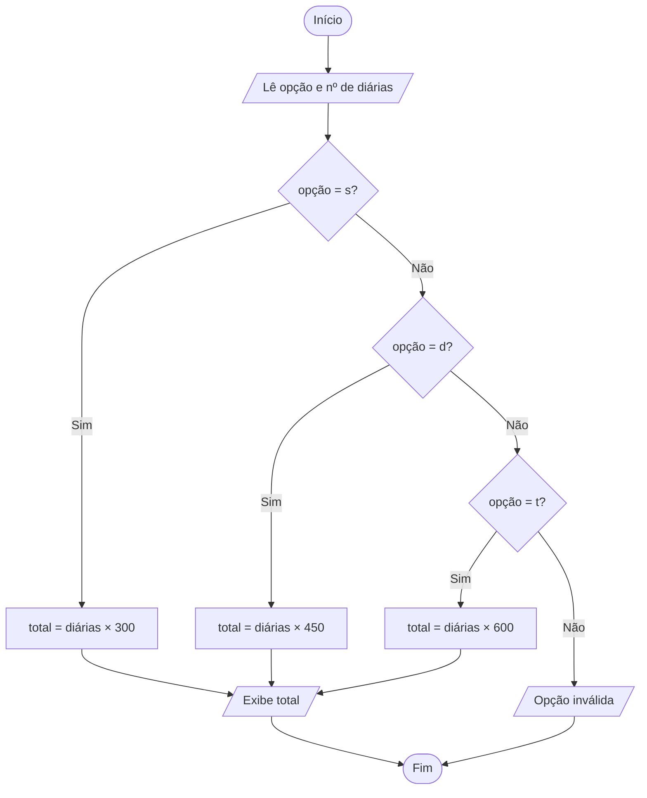

<div align="center">

# 🔀 Aula 04 · Exercício 01

### Hospedagem Anália


[⬅️ Anterior](../../Aula03/Exercicio10/README.md) · [📚 Aula 04](../README.md) · [🏠 Início](../../README.md) · [Próximo ➡️](../../Aula04/Exercicio02/README.md)

</div>

---

## 🎯 Objetivo

Exibir um menu de tipos de quarto, ler a opção escolhida e a quantidade de diárias, e calcular o valor total da hospedagem.

## 🧠 Conceitos aplicados

- Menu de opções com `char`
- `if` / `else if` / `else`
- Operador lógico `||` para aceitar maiúscula e minúscula

**Bibliotecas:** `stdio.h` · `locale.h` · `math.h`

## 📥 Entradas

| Variável | Tipo | Descrição |
|----------|------|-----------|
| `opcao` | `char` | Tipo de quarto: `s`, `d` ou `t` |
| `num_diarias` | `int` | Quantidade de diárias |

## 📤 Saídas

| Variável | Tipo | Descrição |
|----------|------|-----------|
| — | `int` | Total a pagar ou mensagem de opção inválida |

## ⚙️ Lógica

| Opção | Quarto  | Diária  |
|:-----:|---------|--------:|
| `s`   | Simples | R$ 300  |
| `d`   | Duplo   | R$ 450  |
| `t`   | Triplo  | R$ 600  |

## 🗺️ Fluxograma



## ▶️ Como executar

```bash
# Compilar
gcc exercicio01.c -o exercicio01 -lm

# Executar (Windows)
.\exercicio01.exe

# Executar (Linux / macOS)
./exercicio01
```

> [!NOTE]
> Este programa utiliza a biblioteca `math.h`. Em Linux/macOS, a flag `-lm` é necessária para vincular a biblioteca matemática. No Windows (MinGW / Code::Blocks) ela é opcional.

## 💻 Exemplo de execução

```text
Hospedagem Anália
[s] Quarto simples
[d] Quarto Duplo
[t] Quarto Triplo
Digite uma opção: d
Qual a quantidade de diárias: 3
Total a pagar R$ 1350
```

## 📄 Código-fonte

➡️ [`exercicio01.c`](./exercicio01.c)

---

<div align="center">

[⬅️ Anterior](../../Aula03/Exercicio10/README.md) · [📚 Aula 04](../README.md) · [🏠 Início](../../README.md) · [Próximo ➡️](../../Aula04/Exercicio02/README.md)

</div>
