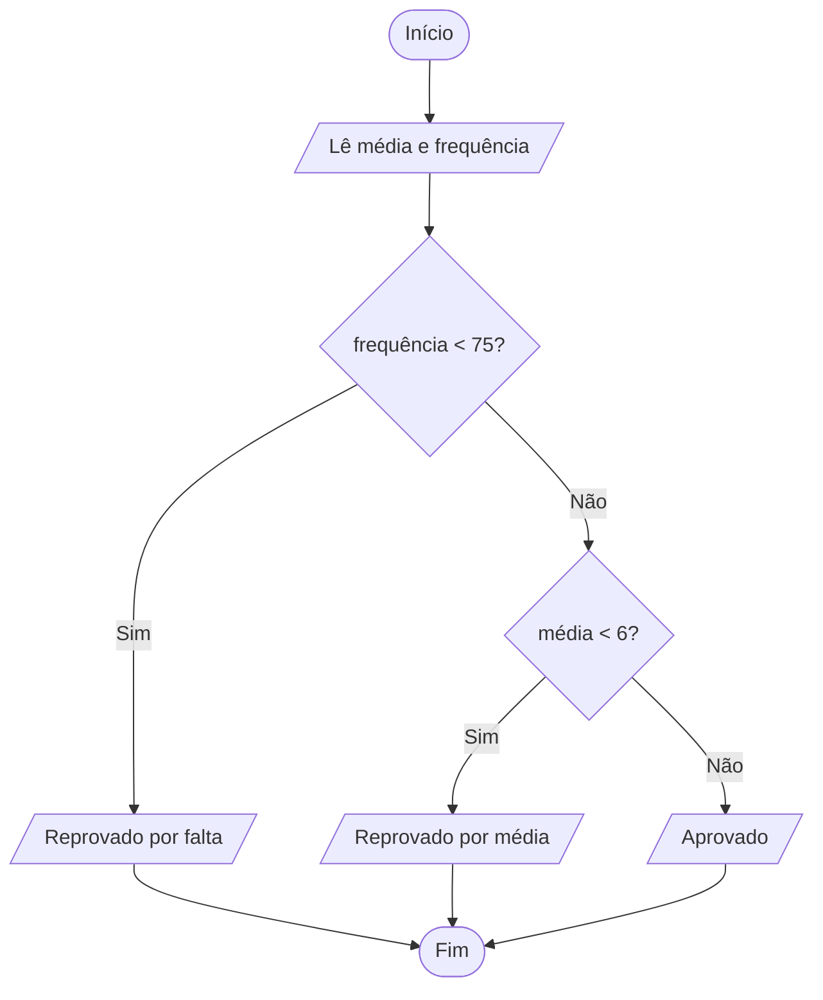

<div align="center">

# 🔀 Aula 04 · Exercício 02

### Situação do Aluno: Média e Frequência


[⬅️ Anterior](../../Aula04/Exercicio01/README.md) · [📚 Aula 04](../README.md) · [🏠 Início](../../README.md) · [Próximo ➡️](../../Aula04/Exercicio03/README.md)

</div>

---

## 🎯 Objetivo

Determinar a situação final do aluno considerando a frequência mínima de 75% e a média mínima 6.

## 🧠 Conceitos aplicados

- Ordem de verificação das condições
- `return` antecipado
- Operadores relacionais

**Bibliotecas:** `stdio.h` · `locale.h`

## 📥 Entradas

| Variável | Tipo | Descrição |
|----------|------|-----------|
| `media` | `float` | Média final do aluno |
| `frequencia` | `float` | Frequência em porcentagem |

## 📤 Saídas

| Variável | Tipo | Descrição |
|----------|------|-----------|
| — | `texto` | Reprovado por falta, Reprovado por média ou Aprovado |

## ⚙️ Lógica

```text
se frequencia < 75  → Reprovado por falta
senão se media < 6  → Reprovado por média
senão               → Aprovado
```

## 🗺️ Fluxograma



## ▶️ Como executar

```bash
# Compilar
gcc exercicio02.c -o exercicio02

# Executar (Windows)
.\exercicio02.exe

# Executar (Linux / macOS)
./exercicio02
```

## 💻 Exemplo de execução

```text
Qual a média do aluno?7.5
Qual a frequência do aluno? 80
Aprovado!!!
```

## 📄 Código-fonte

➡️ [`exercicio02.c`](./exercicio02.c)

---

<div align="center">

[⬅️ Anterior](../../Aula04/Exercicio01/README.md) · [📚 Aula 04](../README.md) · [🏠 Início](../../README.md) · [Próximo ➡️](../../Aula04/Exercicio03/README.md)

</div>
