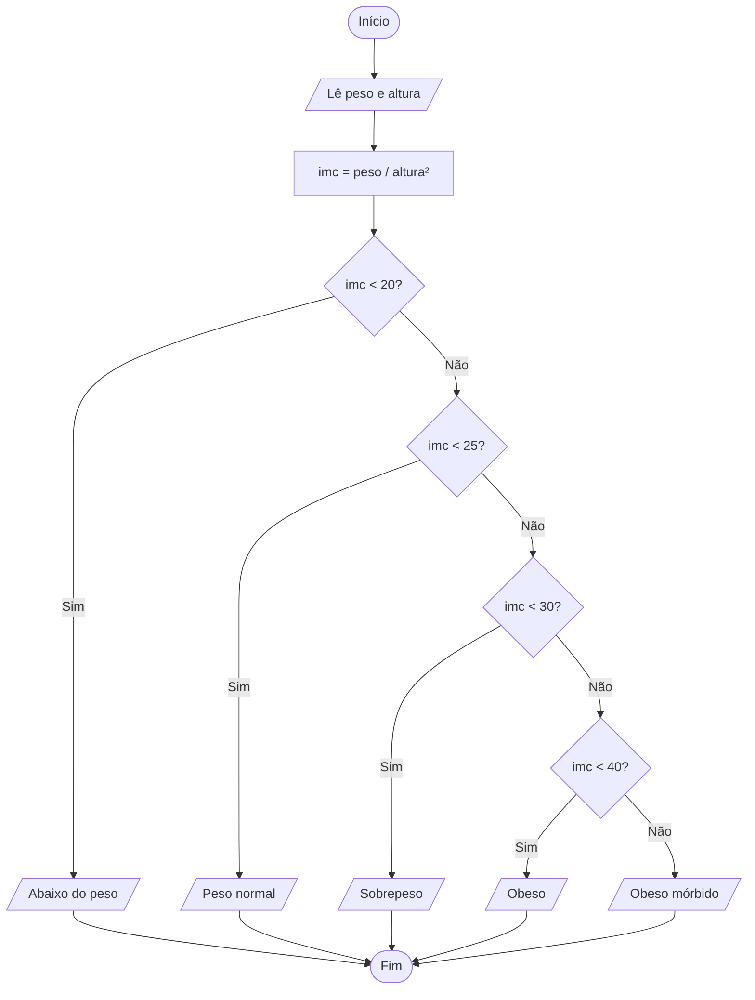

<div align="center">

# 🔀 Aula 04 · Exercício 03

### Classificação do IMC


[⬅️ Anterior](../../Aula04/Exercicio02/README.md) · [📚 Aula 04](../README.md) · [🏠 Início](../../README.md) · [Próximo ➡️](../../Aula04/Exercicio04/README.md)

</div>

---

## 🎯 Objetivo

Calcular o Índice de Massa Corporal (IMC) e classificar o resultado por faixas.

## 🧠 Conceitos aplicados

- `pow` da `math.h`
- `else if` encadeado por faixas de valores

**Bibliotecas:** `stdio.h` · `locale.h` · `math.h`

## 📥 Entradas

| Variável | Tipo | Descrição |
|----------|------|-----------|
| `peso` | `float` | Peso em kg |
| `altura` | `float` | Altura em metros |

## 📤 Saídas

| Variável | Tipo | Descrição |
|----------|------|-----------|
| — | `texto` | Classificação do IMC |

## ⚙️ Lógica

| IMC            | Classificação   |
|----------------|-----------------|
| menor que 20   | Abaixo do peso  |
| 20 até < 25    | Peso normal     |
| 25 até < 30    | Sobrepeso       |
| 30 até < 40    | Obesidade       |
| 40 ou mais     | Obesidade mórbida |

`imc = peso / altura²`

## 🗺️ Fluxograma



## ▶️ Como executar

```bash
# Compilar
gcc exercicio03.c -o exercicio03 -lm

# Executar (Windows)
.\exercicio03.exe

# Executar (Linux / macOS)
./exercicio03
```

> [!NOTE]
> Este programa utiliza a biblioteca `math.h`. Em Linux/macOS, a flag `-lm` é necessária para vincular a biblioteca matemática. No Windows (MinGW / Code::Blocks) ela é opcional.

## 💻 Exemplo de execução

```text
Digite seu peso(kg): 70
Digite sua altura: 1.75
Você está com o peso normal.
```

## 📄 Código-fonte

➡️ [`exercicio03.c`](./exercicio03.c)

---

<div align="center">

[⬅️ Anterior](../../Aula04/Exercicio02/README.md) · [📚 Aula 04](../README.md) · [🏠 Início](../../README.md) · [Próximo ➡️](../../Aula04/Exercicio04/README.md)

</div>
