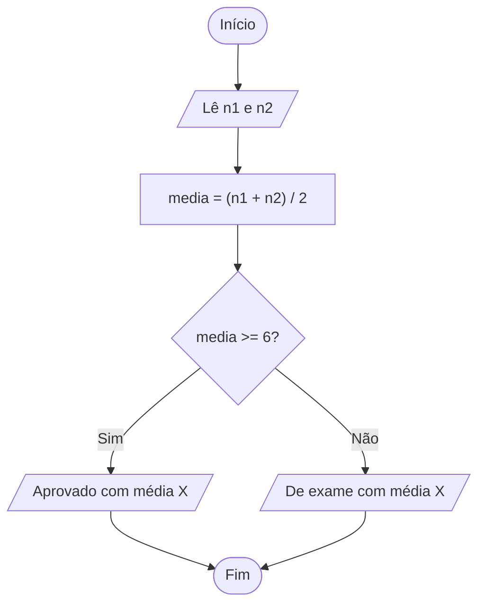

<div align="center">

# 🔀 Aula 04 · Exercício 04

### Aprovação por Média


[⬅️ Anterior](../../Aula04/Exercicio03/README.md) · [📚 Aula 04](../README.md) · [🏠 Início](../../README.md) · [Próximo ➡️](../../Aula04/Exercicio05/README.md)

</div>

---

## 🎯 Objetivo

Ler duas notas, calcular a média e informar se o aluno foi aprovado (média ≥ 6) ou se ficou de exame.

## 🧠 Conceitos aplicados

- `if` / `else`
- Formatação da média na mensagem de saída

**Bibliotecas:** `stdio.h` · `locale.h`

## 📥 Entradas

| Variável | Tipo | Descrição |
|----------|------|-----------|
| `n1` | `float` | Primeira nota |
| `n2` | `float` | Segunda nota |

## 📤 Saídas

| Variável | Tipo | Descrição |
|----------|------|-----------|
| `media` | `float` | Média exibida junto com a situação |

## ⚙️ Lógica

```text
media = (n1 + n2) / 2
se media >= 6 → Aprovado
senão        → Exame
```

## 🗺️ Fluxograma



## ▶️ Como executar

```bash
# Compilar
gcc exercicio04.c -o exercicio04

# Executar (Windows)
.\exercicio04.exe

# Executar (Linux / macOS)
./exercicio04
```

## 💻 Exemplo de execução

```text
Digite a primeira nota:7
Digite a segunda nota:8
Parabéns! Você foi aprovado com média 7.5
```

## 📄 Código-fonte

➡️ [`exercicio04.c`](./exercicio04.c)

---

<div align="center">

[⬅️ Anterior](../../Aula04/Exercicio03/README.md) · [📚 Aula 04](../README.md) · [🏠 Início](../../README.md) · [Próximo ➡️](../../Aula04/Exercicio05/README.md)

</div>
