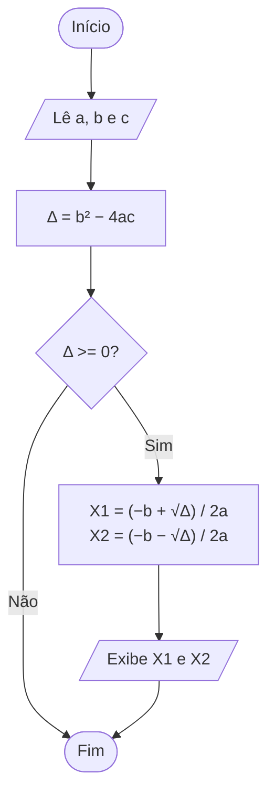

<div align="center">

# 🔀 Aula 04 · Exercício 05

### Raízes da Equação do 2º Grau (Bhaskara)


[⬅️ Anterior](../../Aula04/Exercicio04/README.md) · [📚 Aula 04](../README.md) · [🏠 Início](../../README.md) · [Próximo ➡️](../../Aula06/Exercicio01/README.md)

</div>

---

## 🎯 Objetivo

Ler os coeficientes a, b e c de uma equação do 2º grau e calcular as raízes reais pela fórmula de Bhaskara.

## 🧠 Conceitos aplicados

- Cálculo do discriminante (Δ)
- `sqrt` da `math.h`
- Condição para existência de raízes reais

**Bibliotecas:** `stdio.h` · `locale.h` · `math.h`

## 📥 Entradas

| Variável | Tipo | Descrição |
|----------|------|-----------|
| `valor_a, valor_b, valor_c` | `float` | Coeficientes da equação ax² + bx + c = 0 |

## 📤 Saídas

| Variável | Tipo | Descrição |
|----------|------|-----------|
| `raiz01, raiz02` | `float` | Raízes reais X1 e X2 |

## ⚙️ Lógica

```text
Δ  = b² − 4ac
se Δ >= 0:
    X1 = (−b + √Δ) / 2a
    X2 = (−b − √Δ) / 2a
```

## 🗺️ Fluxograma



## ▶️ Como executar

```bash
# Compilar
gcc exercicio05.c -o exercicio05 -lm

# Executar (Windows)
.\exercicio05.exe

# Executar (Linux / macOS)
./exercicio05
```

> [!NOTE]
> Este programa utiliza a biblioteca `math.h`. Em Linux/macOS, a flag `-lm` é necessária para vincular a biblioteca matemática. No Windows (MinGW / Code::Blocks) ela é opcional.

## 💻 Exemplo de execução

```text
Digite o valor de a:1
Digite o valor de b:-5
Digite o valor de c:6
Raizes da equação:
X1= 3.00
X2=2.00
```

## 📄 Código-fonte

➡️ [`exercicio05.c`](./exercicio05.c)

---

<div align="center">

[⬅️ Anterior](../../Aula04/Exercicio04/README.md) · [📚 Aula 04](../README.md) · [🏠 Início](../../README.md) · [Próximo ➡️](../../Aula06/Exercicio01/README.md)

</div>
