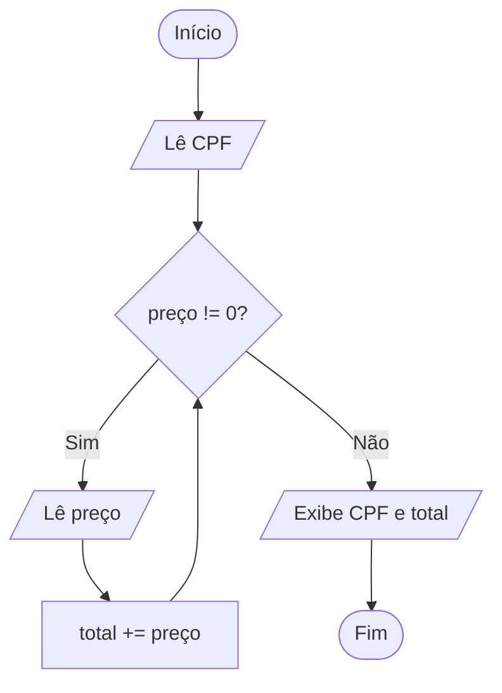

<div align="center">

# 🔁 Aula 06 · Exercício 01

### Caixa de Supermercado


[⬅️ Anterior](../../Aula04/Exercicio05/README.md) · [📚 Aula 06](../README.md) · [🏠 Início](../../README.md) · [Próximo ➡️](../../Aula06/Exercicio02/README.md)

</div>

---

## 🎯 Objetivo

Ler o CPF do cliente e os preços dos produtos até que seja digitado 0, exibindo ao final o CPF e o total da compra.

## 🧠 Conceitos aplicados

- Laço `while` com valor sentinela (0)
- Acumulador (`total += preco`)
- `long long` para números com 11 dígitos

**Bibliotecas:** `stdio.h` · `locale.h`

## 📥 Entradas

| Variável | Tipo | Descrição |
|----------|------|-----------|
| `cpf` | `long long` | CPF do cliente (somente números) |
| `preco` | `float` | Preço de cada produto (0 encerra) |

## 📤 Saídas

| Variável | Tipo | Descrição |
|----------|------|-----------|
| `cpf` | `long long` | CPF informado |
| `total` | `float` | Valor total da compra |

## ⚙️ Lógica

```text
enquanto preco != 0:
    lê preco
    total += preco
```

## 🗺️ Fluxograma



## ▶️ Como executar

```bash
# Compilar
gcc exercicio01.c -o exercicio01

# Executar (Windows)
.\exercicio01.exe

# Executar (Linux / macOS)
./exercicio01
```

## 💻 Exemplo de execução

```text
Digite o seu CPF (somente números): 12345678901
Preço: 10.50
Preço: 20
Preço: 0
CPF: 12345678901
Total da compra: R$ 30.50
```

## 📄 Código-fonte

➡️ [`exercicio01.c`](./exercicio01.c)

---

<div align="center">

[⬅️ Anterior](../../Aula04/Exercicio05/README.md) · [📚 Aula 06](../README.md) · [🏠 Início](../../README.md) · [Próximo ➡️](../../Aula06/Exercicio02/README.md)

</div>
