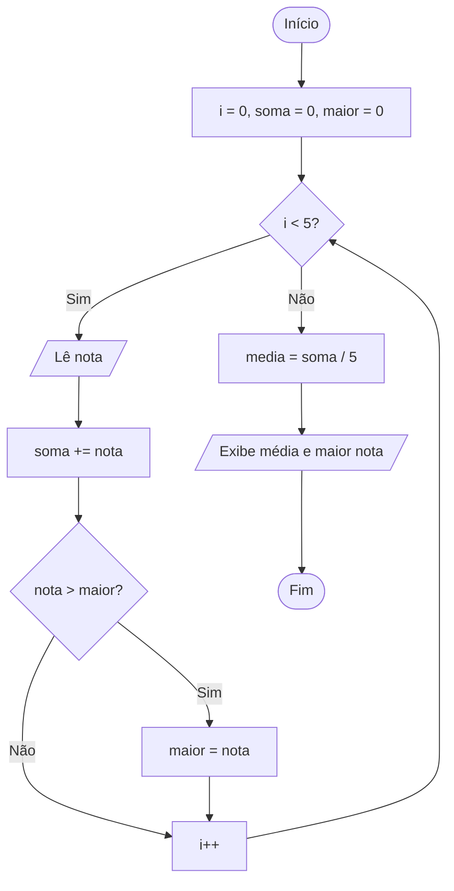

<div align="center">

# 🔁 Aula 06 · Exercício 02

### Média e Maior Nota da Turma


[⬅️ Anterior](../../Aula06/Exercicio01/README.md) · [📚 Aula 06](../README.md) · [🏠 Início](../../README.md) · [Próximo ➡️](../../Aula06/Exercicio03/README.md)

</div>

---

## 🎯 Objetivo

Ler as notas de 5 estudantes, calcular a média da turma e identificar a maior nota.

## 🧠 Conceitos aplicados

- Laço `for` com contador
- Acumulador
- Busca do maior valor

**Bibliotecas:** `stdio.h` · `locale.h`

## 📥 Entradas

| Variável | Tipo | Descrição |
|----------|------|-----------|
| `nota` | `float` | Nota de cada um dos 5 estudantes |

## 📤 Saídas

| Variável | Tipo | Descrição |
|----------|------|-----------|
| `media` | `float` | Média da turma |
| `maior_nota` | `float` | Maior nota informada |

## ⚙️ Lógica

```text
para i de 0 até 4:
    lê nota
    soma += nota
    se nota > maior_nota → maior_nota = nota
media = soma / 5
```

## 🗺️ Fluxograma



## ▶️ Como executar

```bash
# Compilar
gcc exercicio02.c -o exercicio02

# Executar (Windows)
.\exercicio02.exe

# Executar (Linux / macOS)
./exercicio02
```

## 💻 Exemplo de execução

```text
digite a nota do 1º estudante: 7
digite a nota do 2º estudante: 8
digite a nota do 3º estudante: 6.5
digite a nota do 4º estudante: 9
digite a nota do 5º estudante: 10
Média da turma: 8.10
Maior nota: 10.00
```

## 📄 Código-fonte

➡️ [`exercicio02.c`](./exercicio02.c)

---

<div align="center">

[⬅️ Anterior](../../Aula06/Exercicio01/README.md) · [📚 Aula 06](../README.md) · [🏠 Início](../../README.md) · [Próximo ➡️](../../Aula06/Exercicio03/README.md)

</div>
