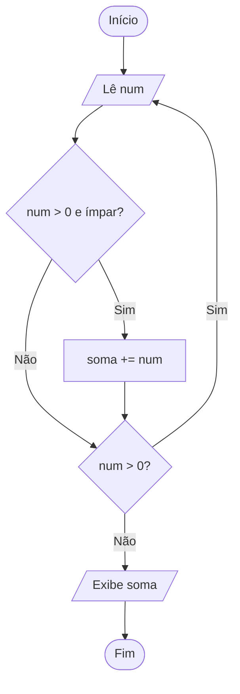

<div align="center">

# 🔁 Aula 06 · Exercício 03

### Soma dos Números Ímpares


[⬅️ Anterior](../../Aula06/Exercicio02/README.md) · [📚 Aula 06](../README.md) · [🏠 Início](../../README.md) · [Próximo ➡️](../../Aula06/Exercicio04/README.md)

</div>

---

## 🎯 Objetivo

Ler números inteiros até que seja digitado 0 ou um valor negativo e exibir a soma dos números ímpares informados.

## 🧠 Conceitos aplicados

- Laço `do-while`
- Operador módulo (`%`) para testar paridade
- Acumulador condicional

**Bibliotecas:** `stdio.h` · `locale.h`

## 📥 Entradas

| Variável | Tipo | Descrição |
|----------|------|-----------|
| `num` | `int` | Números inteiros (0 ou negativo encerra) |

## 📤 Saídas

| Variável | Tipo | Descrição |
|----------|------|-----------|
| `soma` | `int` | Soma dos números ímpares |

## ⚙️ Lógica

```text
faça:
    lê num
    se num > 0 e num % 2 != 0 → soma += num
enquanto num > 0
```

## 🗺️ Fluxograma



## ▶️ Como executar

```bash
# Compilar
gcc exercicio03.c -o exercicio03

# Executar (Windows)
.\exercicio03.exe

# Executar (Linux / macOS)
./exercicio03
```

## 💻 Exemplo de execução

```text
Digite um número: 3
Digite um número: 4
Digite um número: 5
Digite um número: 0
A soma dos números ímpares é: 8
```

## 📄 Código-fonte

➡️ [`exercicio03.c`](./exercicio03.c)

---

<div align="center">

[⬅️ Anterior](../../Aula06/Exercicio02/README.md) · [📚 Aula 06](../README.md) · [🏠 Início](../../README.md) · [Próximo ➡️](../../Aula06/Exercicio04/README.md)

</div>
