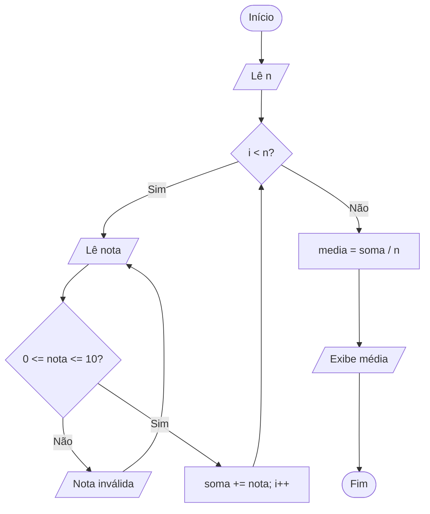

<div align="center">

# 🔁 Aula 06 · Exercício 04

### Média da Turma com Validação de Notas


[⬅️ Anterior](../../Aula06/Exercicio03/README.md) · [📚 Aula 06](../README.md) · [🏠 Início](../../README.md) · [Próximo ➡️](../../Aula06/Exercicio05/README.md)

</div>

---

## 🎯 Objetivo

Ler a quantidade de alunos e a nota de cada um, aceitando apenas notas entre 0 e 10, e exibir a média da turma.

## 🧠 Conceitos aplicados

- Laço `for` com laço `do-while` aninhado
- Validação de entrada
- Quantidade de repetições definida pelo usuário

**Bibliotecas:** `stdio.h` · `locale.h`

## 📥 Entradas

| Variável | Tipo | Descrição |
|----------|------|-----------|
| `n` | `int` | Quantidade de alunos |
| `nota` | `float` | Nota de cada aluno (0 a 10) |

## 📤 Saídas

| Variável | Tipo | Descrição |
|----------|------|-----------|
| `media` | `float` | Média da turma |

## ⚙️ Lógica

```text
para cada aluno:
    repita:
        lê nota
        se nota fora de [0, 10] → Nota inválida
        senão                  → soma += nota
    até a nota ser válida
media = soma / n
```

## 🗺️ Fluxograma



## ▶️ Como executar

```bash
# Compilar
gcc exercicio04.c -o exercicio04

# Executar (Windows)
.\exercicio04.exe

# Executar (Linux / macOS)
./exercicio04
```

## 💻 Exemplo de execução

```text
Quantidade de alunos: 3

Digite a nota do aluno (0-10): 8

Digite a nota do aluno (0-10): 11
Nota inválida!!! Tente outra vez!!

Digite a nota do aluno (0-10): 7

Digite a nota do aluno (0-10): 9

Média da turma: 8.00
```

## 📄 Código-fonte

➡️ [`exercicio04.c`](./exercicio04.c)

---

<div align="center">

[⬅️ Anterior](../../Aula06/Exercicio03/README.md) · [📚 Aula 06](../README.md) · [🏠 Início](../../README.md) · [Próximo ➡️](../../Aula06/Exercicio05/README.md)

</div>
