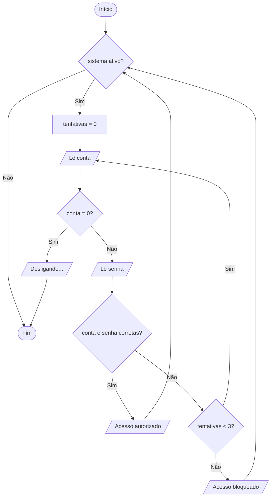

<div align="center">

# 🔁 Aula 06 · Exercício 05

### Terminal de Atendimento Bancário


[⬅️ Anterior](../../Aula06/Exercicio04/README.md) · [📚 Aula 06](../README.md) · [🏠 Início](../../README.md) · Próximo ➡️

</div>

---

## 🎯 Objetivo

Simular um terminal de autoatendimento que valida conta e senha com até 3 tentativas, bloqueando o acesso após 3 erros. O terminal continua ativo até que a conta 0 seja digitada.

## 🧠 Conceitos aplicados

- Laço `while` externo controlado por flag (`sistema_ativo`)
- Laço `do-while` interno limitado a 3 tentativas
- `break` para sair do laço
- Operador lógico `&&`

**Bibliotecas:** `stdio.h`

## 📥 Entradas

| Variável | Tipo | Descrição |
|----------|------|-----------|
| `conta` | `int` | Número da conta (0 desliga o terminal) |
| `senha` | `int` | Senha da conta |

## 📤 Saídas

| Variável | Tipo | Descrição |
|----------|------|-----------|
| — | `texto` | Acesso autorizado, credenciais incorretas ou acesso bloqueado |

## ⚙️ Lógica

```text
Conta válida: 12345  |  Senha válida: 123

enquanto sistema_ativo:
    até 3 tentativas:
        conta = 0            → desliga o terminal
        conta e senha certas → Acesso autorizado
        caso contrário       → nova tentativa
    3 erros → Acesso bloqueado
```

## 🗺️ Fluxograma



## ▶️ Como executar

```bash
# Compilar
gcc exercicio05.c -o exercicio05

# Executar (Windows)
.\exercicio05.exe

# Executar (Linux / macOS)
./exercicio05
```

## 💻 Exemplo de execução

```text
===================================
        TERMINAL DE ATENDIMENTO
   (Digite 0 na conta para desligar)
===================================
Conta: 12345
Senha: 999

Credenciais incorretas. Tentativa 1 de 3.

Conta: 12345
Senha: 123

Saida:
Acesso autorizado.

===================================
        TERMINAL DE ATENDIMENTO
   (Digite 0 na conta para desligar)
===================================
Conta: 0
Desligando o terminal...
```

## 📄 Código-fonte

➡️ [`exercicio05.c`](./exercicio05.c)

---

<div align="center">

[⬅️ Anterior](../../Aula06/Exercicio04/README.md) · [📚 Aula 06](../README.md) · [🏠 Início](../../README.md) · Próximo ➡️

</div>
