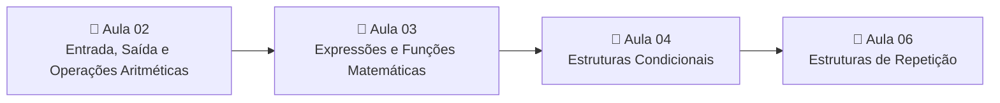

<div align="center">

# 💻 Algoritmos e Programação de Computadores

**Exercícios desenvolvidos em linguagem C durante a disciplina de Algoritmos e Programação de Computadores**


[Sobre](#sobre) · [Estrutura](#estrutura) · [Aulas](#aulas) · [Exercícios](#exercicios) · [Como executar](#como-executar) · [Autor](#autor)

</div>

---

<a id="sobre"></a>

## 📌 Sobre

Este repositório reúne as soluções dos exercícios práticos da disciplina de **Algoritmos e Programação de Computadores**,
organizadas por aula e por exercício. Cada exercício possui sua própria pasta com o código-fonte em C e um `README.md`
explicando o objetivo, os conceitos aplicados, as entradas e saídas, a lógica utilizada e um exemplo real de execução.

A organização segue uma progressão natural de aprendizado:



<a id="estrutura"></a>

## 📂 Estrutura do repositório

```text
Algoritmos-e-PC/
├── README.md
├── Aula02/
│   ├── README.md
│   ├── Exercicio01/
│   ├── Exercicio02/
│   ├── Exercicio03/
│   ├── Exercicio04/
│   └── Exercicio05/
├── Aula03/
│   ├── README.md
│   ├── Exercicio01/
│   ├── Exercicio02/
│   ├── Exercicio04/
│   ├── Exercicio06/
│   ├── Exercicio07/
│   ├── Exercicio09/
│   └── Exercicio10/
├── Aula04/
│   ├── README.md
│   ├── Exercicio01/
│   ├── Exercicio02/
│   ├── Exercicio03/
│   ├── Exercicio04/
│   └── Exercicio05/
└── Aula06/
    ├── README.md
    ├── Exercicio01/
    ├── Exercicio02/
    ├── Exercicio03/
    ├── Exercicio04/
    └── Exercicio05/
```

> Cada pasta `ExercicioXX/` contém:
> - `exercicioXX.c` — código-fonte da solução
> - `README.md` — documentação do exercício

<a id="aulas"></a>

## 📚 Aulas

| Aula | Tema | Exercícios |
|------|------|:----------:|
| 🧮 [Aula 02](./Aula02/README.md) | Entrada, Saída e Operações Aritméticas | 5 |
| 📐 [Aula 03](./Aula03/README.md) | Expressões e Funções Matemáticas | 7 |
| 🔀 [Aula 04](./Aula04/README.md) | Estruturas Condicionais | 5 |
| 🔁 [Aula 06](./Aula06/README.md) | Estruturas de Repetição | 5 |
| | **Total** | **22** |

<a id="exercicios"></a>

## 🗂️ Índice de exercícios

> Clique em uma aula para expandir a lista de exercícios.

<details>
<summary><b>🧮 Aula 02 — Entrada, Saída e Operações Aritméticas</b> (5 exercícios)</summary>
<br>

| Nº | Exercício | Código |
|:--:|-----------|--------|
| 01 | [Perímetro da Circunferência](./Aula02/Exercicio01/README.md) | [`exercicio01.c`](./Aula02/Exercicio01/exercicio01.c) |
| 02 | [Perímetro e Área do Jardim](./Aula02/Exercicio02/README.md) | [`exercicio02.c`](./Aula02/Exercicio02/exercicio02.c) |
| 03 | [Tempo de Gestação em Meses](./Aula02/Exercicio03/README.md) | [`exercicio03.c`](./Aula02/Exercicio03/exercicio03.c) |
| 04 | [Consumo Diário de Água](./Aula02/Exercicio04/README.md) | [`exercicio04.c`](./Aula02/Exercicio04/exercicio04.c) |
| 05 | [Média Aritmética de Duas Notas](./Aula02/Exercicio05/README.md) | [`exercicio05.c`](./Aula02/Exercicio05/exercicio05.c) |

</details>
<details>
<summary><b>📐 Aula 03 — Expressões e Funções Matemáticas</b> (7 exercícios)</summary>
<br>

| Nº | Exercício | Código |
|:--:|-----------|--------|
| 01 | [Total de Produtos Recebidos](./Aula03/Exercicio01/README.md) | [`exercicio01.c`](./Aula03/Exercicio01/exercicio01.c) |
| 02 | [Minutos Desde o Início do Dia](./Aula03/Exercicio02/README.md) | [`exercicio02.c`](./Aula03/Exercicio02/exercicio02.c) |
| 04 | [Consumo Mensal de Energia](./Aula03/Exercicio04/README.md) | [`exercicio04.c`](./Aula03/Exercicio04/exercicio04.c) |
| 06 | [Orçamento de Revestimento](./Aula03/Exercicio06/README.md) | [`exercicio06.c`](./Aula03/Exercicio06/exercicio06.c) |
| 07 | [Média Aritmética de Quatro Valores](./Aula03/Exercicio07/README.md) | [`exercicio07.c`](./Aula03/Exercicio07/exercicio07.c) |
| 09 | [Distância Entre Dois Pontos](./Aula03/Exercicio09/README.md) | [`exercicio09.c`](./Aula03/Exercicio09/exercicio09.c) |
| 10 | [Alcance de um Lançamento Oblíquo](./Aula03/Exercicio10/README.md) | [`exercicio10.c`](./Aula03/Exercicio10/exercicio10.c) |

</details>
<details>
<summary><b>🔀 Aula 04 — Estruturas Condicionais</b> (5 exercícios)</summary>
<br>

| Nº | Exercício | Código |
|:--:|-----------|--------|
| 01 | [Hospedagem Anália](./Aula04/Exercicio01/README.md) | [`exercicio01.c`](./Aula04/Exercicio01/exercicio01.c) |
| 02 | [Situação do Aluno: Média e Frequência](./Aula04/Exercicio02/README.md) | [`exercicio02.c`](./Aula04/Exercicio02/exercicio02.c) |
| 03 | [Classificação do IMC](./Aula04/Exercicio03/README.md) | [`exercicio03.c`](./Aula04/Exercicio03/exercicio03.c) |
| 04 | [Aprovação por Média](./Aula04/Exercicio04/README.md) | [`exercicio04.c`](./Aula04/Exercicio04/exercicio04.c) |
| 05 | [Raízes da Equação do 2º Grau (Bhaskara)](./Aula04/Exercicio05/README.md) | [`exercicio05.c`](./Aula04/Exercicio05/exercicio05.c) |

</details>
<details>
<summary><b>🔁 Aula 06 — Estruturas de Repetição</b> (5 exercícios)</summary>
<br>

| Nº | Exercício | Código |
|:--:|-----------|--------|
| 01 | [Caixa de Supermercado](./Aula06/Exercicio01/README.md) | [`exercicio01.c`](./Aula06/Exercicio01/exercicio01.c) |
| 02 | [Média e Maior Nota da Turma](./Aula06/Exercicio02/README.md) | [`exercicio02.c`](./Aula06/Exercicio02/exercicio02.c) |
| 03 | [Soma dos Números Ímpares](./Aula06/Exercicio03/README.md) | [`exercicio03.c`](./Aula06/Exercicio03/exercicio03.c) |
| 04 | [Média da Turma com Validação de Notas](./Aula06/Exercicio04/README.md) | [`exercicio04.c`](./Aula06/Exercicio04/exercicio04.c) |
| 05 | [Terminal de Atendimento Bancário](./Aula06/Exercicio05/README.md) | [`exercicio05.c`](./Aula06/Exercicio05/exercicio05.c) |

</details>

<a id="como-executar"></a>

## ⚙️ Como compilar e executar

### Pré-requisitos

- Um compilador C — recomendado o **[GCC](https://gcc.gnu.org/)**
  - **Windows:** [MinGW-w64](https://www.mingw-w64.org/) ou a IDE [Code::Blocks](https://www.codeblocks.org/) (já inclui o MinGW)
  - **Linux:** `sudo apt install build-essential`
  - **macOS:** `xcode-select --install`

### Passo a passo

```bash
# 1. Clone o repositório
git clone https://github.com/IsaacBLozano/Algoritmos-e-PC.git
cd Algoritmos-e-PC

# 2. Entre na pasta do exercício desejado
cd Aula03/Exercicio09

# 3. Compile (use -lm quando o programa incluir math.h)
gcc exercicio09.c -o exercicio09 -lm

# 4. Execute
./exercicio09        # Linux / macOS
.\exercicio09.exe    # Windows
```

> [!TIP]
> No **Windows**, se os acentos aparecerem com caracteres estranhos no terminal, execute `chcp 65001`
> antes de rodar o programa para ativar a codificação UTF-8.

## 📏 Padrões adotados

| Item | Padrão |
|------|--------|
| Pastas de aula | `AulaXX/` (dois dígitos) |
| Pastas de exercício | `ExercicioXX/` (numeração conforme a lista da aula) |
| Código-fonte | `exercicioXX.c` |
| Codificação | UTF-8 |
| Arquivos compilados | Ignorados pelo Git (`.gitignore`) |

<a id="autor"></a>

## 👤 Autor

<div align="center">

**Isaac Lozano**

Estudante da disciplina de Algoritmos e Programação de Computadores

[](https://github.com/IsaacBLozano)

</div>

---

<div align="center">
<sub>Feito com dedicação e muito <code>printf</code> por Isaac Lozano.</sub>
</div>
